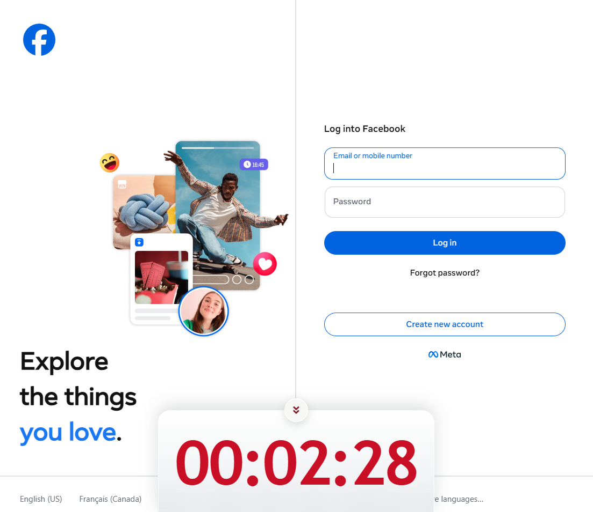

# Social Network Daily Timer

Chrome extension showing one shared daily social-media usage timer at bottom center of supported pages.



## Behavior

- Counts only active social tab in focused Chrome window.
- Never double-counts multiple tabs or windows.
- Persists timestamp-only completed intervals and one active interval across reloads and Chrome restarts.
- Resets at local midnight.
- Stops counting on unsupported pages or when Chrome loses focus.
- Stops counting and hides the timer on social sites disabled in extension settings.
- Stores no URL, hostname, page title, tab id, origin, or account identifier.
- Circular collapse button hides timer in current tab for one minute; refresh/navigation shows it again.

Supported sites:

- Facebook
- Instagram
- X / Twitter
- Reddit
- TikTok
- LinkedIn
- YouTube
- Threads
- Bluesky

## Install

1. Open `chrome://extensions`.
2. Enable **Developer mode**.
3. Select **Load unpacked**.
4. Select this project folder.
5. Select **Details** > **Extension options** to enable or disable sites.

## Development

```bash
npm test
npm run validate
npm run build
```

`npm run build` creates `dist/social-network-timer-2.0.0.zip` for Chrome Web Store upload. No Node third-party dependencies required; build uses the system `zip` command.

## Permissions

- `storage`: save timestamp-only current-day timer intervals.
- `tabs`: identify active supported page and synchronize visible timers.
- `alarms`: wake the service worker to sync current activity state.
- Supported-site host permissions: inject timer UI only on listed sites.
